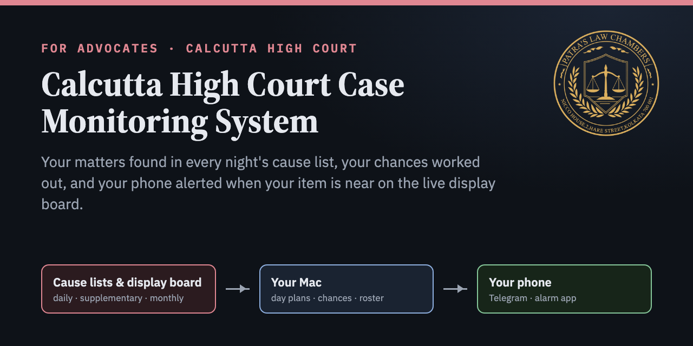

# Calcutta High Court Case Monitoring System



For advocates of the Calcutta High Court. You enter your name once. Every night the system finds your
matters in the cause lists and tells you on Telegram which court, item and heading each matter is in, and
how likely it is to be reached. During court hours it watches the live display board and rings your phone
when your item is near, when it is on, or when its heading closes before your item. At any time you can ask
it about any court, judge, group of matters or case, and forward it a bar notice when the courts rise early.

**Instruction manual:** https://advocatesudippatra-spec.github.io/calcutta-high-court-case-monitoring-system/ (also as a Claude artifact: https://claude.ai/artifact/3fDuCP8odrGhVFBABjJSu3, and in [`docs/manual.html`](docs/manual.html))

## Try it without installing

Shows the report for any name and date on screen. Nothing is installed and no message is sent.

```bash
git clone https://github.com/advocatesudippatra-spec/calcutta-high-court-case-monitoring-system ~/CaseMonitoringSystem
~/CaseMonitoringSystem/try.sh "ARUN KUMAR SEN, A K SEN" 25092026
```

## Install

You need a Mac that is on during court hours (a Mac mini is ideal), Google Chrome, and Telegram on your phone.

1. **Make your Telegram bot:** in Telegram open **@BotFather**, send `/newbot`, and keep the token.
2. **Install** with one line in Terminal:
   ```bash
   curl -fsSL https://raw.githubusercontent.com/advocatesudippatra-spec/calcutta-high-court-case-monitoring-system/main/get.sh | bash
   ```
   or with the GitHub tool:
   ```bash
   gh repo clone advocatesudippatra-spec/calcutta-high-court-case-monitoring-system ~/CaseMonitoringSystem && ~/CaseMonitoringSystem/install.sh
   ```
3. **Answer the setup questions:** name(s), bot token, Android or iPhone, Pushover keys (iPhone alarms), sides to
   check nightly, main Mac, and whether the board should open by itself at 10:15. Change them any time with
   `~/.casemonitor/casemonitor setup`.
4. **Board Watcher:** install **Tampermonkey** in Chrome, turn on *Allow User Scripts*, then open
   `http://127.0.0.1:8766/watcher.user.js` on the main Mac and click **Install**. It updates itself and takes its
   settings from the program.
5. **Phone alarms:** Android: ntfy (topic shown at the end of setup, or send `/ntfy`). iPhone: Pushover.

## Daily routine

Type the CAPTCHA when the display board opens on your Mac at about 10:15 AM. Everything else is automatic.

## What it does

- **Reads the lists:** Appellate Side daily and supplementary lists every night; Original Side and Jalpaiguri
  on a 10 PM button; monthly lists, including "items x to y of the monthly list dated …" directions; Monday's
  list from Saturday; holidays; retries when the court site drops a connection.
- **Works out chances:** day plan of each court (headings, item ranges, time slots from the Bench's note, fixed
  items, sitting times, the other side's hours); your item judged inside its own heading; unclear notes quoted.
- **Reminds you:** 8:30/9:30 PM heads-up, 10 PM report with a table file, catch-up report, 8:30/9:30/10 AM
  reminders, loud alarm through ntfy (Android) or Pushover (iPhone).
- **Watches the board:** today's matters loaded by itself; 20/10/5 away, item ON, "heading closed before your
  item", jumps past your item; planned moves not treated as skips; stale board, CAPTCHA and "court not on
  board" alerts; stops when courts rise; 30-day record; 5 PM summary.
- **Answers questions:** `group 6`, `anticipatory bail`, `justice …`, `court 35`, `mentioning 25`, `fixed 35`,
  `find 1234`, `advocate …`, `party …`, `running 12`, `board`, `my courts`, `courts`, history and `changes`;
  reads a cause-list PDF you send.
- **Remembers the roster:** every list read is kept until you delete it (about 2 MB a day); who took which
  matters and when; messages when a court's judge or determination changes; past lists can be loaded.
- **Court notices:** forwarded, pasted, photo or PDF; `/rise 3:30 pm`; notices in a registered group.
- **Several Macs:** main Mac plus backups sharing one memory (no duplicate messages); daily self-update.

## Files

| File | What it is |
|---|---|
| `casemonitor.py` | Schedule, Telegram, setup questions, alarms (ntfy, Pushover), listener, board link |
| `causelist.py` | Downloads and reads the cause list PDFs; day plans, Bench-note timetable, likelihood |
| `roster.py` | Whole cause list and board in a database; plain-words questions and history |
| `watcher.user.js` | Board Watcher for Tampermonkey (served from the Mac, updates itself) |
| `install.sh`, `get.sh`, `uninstall.sh`, `try.sh` | Install, one-line install, remove, try for any name |
| `ocr.swift` | Reads notices sent as photos (macOS text recognition) |
| `court_mode.sh`, `* Court Mode.command` | Keep a MacBook awake during court |
| `docs/manual.html` | The instruction manual |

Everything runs on your own Mac with your own Telegram bot; your name, matters and history stay there.

## About the author

**Sudip Patra** is an Advocate, enrolled in 2017, practising before the Supreme Court of India and the Calcutta
High Court. An engineer by training, he studied law at the Rajiv Gandhi School of Intellectual Property Law,
IIT Kharagpur, and business law at IIM Calcutta. He is the Founder and Principal Advocate of Patra's Law Chambers.
This system grew out of his daily practice at the Calcutta High Court.

**Patra's Law Chambers**, established in 2020, has offices in Kolkata and New Delhi. It appears before the
Supreme Court of India, the Calcutta High Court, the Armed Forces Tribunal, the Central Administrative Tribunal,
the Debts Recovery Tribunal and DRAT, CESTAT, the NCLT, and the district, sessions, family and consumer courts of
West Bengal, in civil, criminal, service, banking, tax, property, family, intellectual property, company and
cyber-law matters. Website: https://patraslawchambers.com/

## Licence and disclaimer

Released under the [MIT Licence](LICENSE) © 2026 Sudip Patra, Patra's Law Chambers. You may use, copy and adapt it
freely; it comes with no warranty.

The system only reads the Calcutta High Court's public cause lists; the display board's CAPTCHA is always typed by
the user. Chances are estimates from the cause list and the Bench's notes and are not legal advice or a
prediction by the Court; always check the determination and the court's own records. Not affiliated with the
Calcutta High Court.
