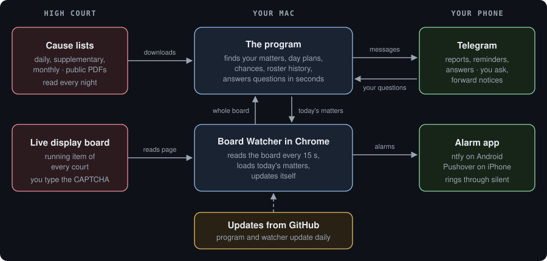
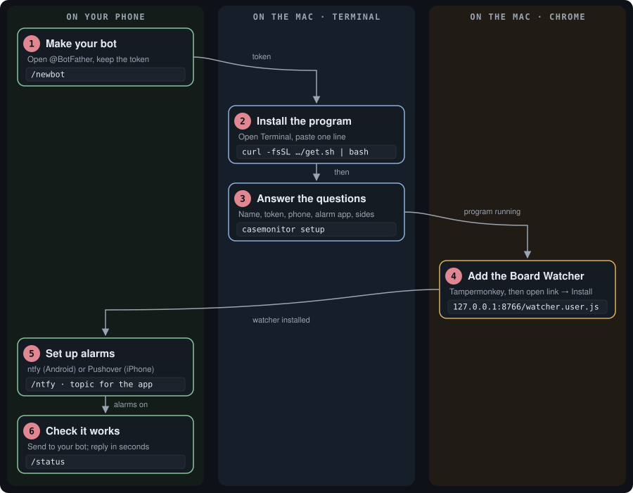

# Calcutta High Court Case Monitoring System


You enter your name once. Every night the system finds your matters in the Calcutta High Court cause lists and
tells you on Telegram which court, which item, under which heading, and how likely each matter is to be reached.
During court hours it watches the live display board and rings your phone when your item is near, when it is on,
or when its heading closes before your item. At any time you can ask it about any court, any judge, any group of
matters or any case, and forward it a bar notice when the courts rise early.

**Manual as a web page:** https://advocatesudippatra-spec.github.io/calcutta-high-court-case-monitoring-system/
· Claude artifact: https://claude.ai/artifact/3fDuCP8odrGhVFBABjJSu3 · [MIT Licence](LICENSE)

**Contents:** [Your day](#your-day-with-it) · [How it works](#how-it-works) · [Set up](#set-up-about-15-minutes-once)
· [Phone](#phone-setup) · [Daily routine](#daily-routine) · [How "likely" works](#how-likely-is-worked-out)
· [Ask the bot](#ask-the-bot) · [Early rising](#courts-rising-early) · [All commands](#all-commands)
· [Feature checklist](#feature-checklist) · [Questions](#questions) · [About](#about-the-author)

---

## Your day with it

What arrives on your phone in an ordinary court week, and the one thing you do yourself.

| When | What arrives | You do |
|---|---|---|
| 8:30 & 9:30 PM | Heads-up, only when a matter tomorrow is realistically likely, with its likely time | Nothing |
| 10:00 PM | Tomorrow's report: every matter with court, judge, item, heading, day plan, chance and reason, plus a table file. Buttons to add Original Side or Jalpaiguri | Tap a button if needed |
| Saturday / Sunday | Monday's report as soon as Monday's list is published (usually Saturday) | Nothing |
| 8:30 – 10:00 AM | Reminders listing every matter today with its chance; loud alarm at 10:00 when one is likely | Nothing |
| About 10:15 AM | The display board opens on your Mac by itself; the watcher loads today's matters | **Type the CAPTCHA** |
| Court hours | 20, 10 and 5 items away, "your item is on", or "heading closed before your item" | Nothing |
| 5:00 PM | Day summary: how each of your courts moved, and what happened to each item | Nothing |
| Any time | Ask about any court, judge, group or case; forward a bar notice and everything adjusts | Optional |

## How it works

The High Court publishes cause lists as public PDF files and shows the running items on its display board. Your Mac
reads both and works everything out. Your phone receives the results through Telegram and an alarm app. Nothing is
kept on anyone else's computer.



Each person runs their own copy with their own Telegram bot. A second Mac can run as a backup; the two share one
memory through a pinned Telegram message, so you never get duplicate messages.

## Set up (about 15 minutes, once)

You need a Mac that is switched on during court hours (a Mac mini is ideal because it does not sleep), Google Chrome
on that Mac, and Telegram on your phone.



1. **Make your own Telegram bot.** In Telegram, open **@BotFather**, send `/newbot`, choose a display name and a
   username ending in `bot`. Keep the token it replies with (it looks like `123456789:AA…`). Your bot talks only to you.
2. **Install the program.** Open Terminal (Applications › Utilities › Terminal), paste this line and press Return:
   ```bash
   curl -fsSL https://raw.githubusercontent.com/advocatesudippatra-spec/calcutta-high-court-case-monitoring-system/main/get.sh | bash
   ```
   If the Mac asks to install Apple's developer tools, click Install and run the line again.
3. **Answer the setup questions.** The installer asks, then does everything else. Run them again any time with
   `~/.casemonitor/casemonitor setup`.
   ```text
   Your name as printed in the cause list (other spellings separated by commas): ARUN KUMAR SEN, A K SEN
   Paste your Telegram bot token: 123456789:AA…
   Token OK. Open your bot in Telegram and send: hello
   Connected to your chat.
   Your phone: 1 = Android, 2 = iPhone: 2
   Pushover User Key (Enter to skip): u9x…
   Check every night: A = Appellate, O = Original, J = Jalpaiguri: A
   Is this your main Mac (switched on during court hours)? [Y/n] Y
   Open the display board by itself at about 10:15 on court days? [Y/n] Y
   Done. A test message is on your phone.
   ```
4. **Add the Board Watcher to Chrome.** Install **Tampermonkey** (by Jan Biniok) from the Chrome Web Store. Type
   `chrome://extensions` in Chrome's address bar, open Tampermonkey's Details and turn on *Allow User Scripts*. Then
   open `http://127.0.0.1:8766/watcher.user.js` in Chrome on the same Mac and click **Install**. It updates itself
   and takes its alert settings from the program, so there is nothing to paste.
5. **Check that it works.** Send `/status` to your bot; a reply comes within seconds. On the Mac:
   ```bash
   ~/.casemonitor/casemonitor status
   ```

To look first without installing anything, this shows the report for any name and date on screen:

```bash
git clone https://github.com/advocatesudippatra-spec/calcutta-high-court-case-monitoring-system ~/CaseMonitoringSystem
~/CaseMonitoringSystem/try.sh "ARUN KUMAR SEN, A K SEN" 25092026
```

## Phone setup

Telegram carries every report, reminder and answer on both kinds of phone. For the loud alarm that rings even when
the phone is silent, Android uses the free **ntfy** app and iPhone uses **Pushover**.

<details open>
<summary><b>Android</b></summary>

1. **Telegram:** open your bot, tap its name, and turn Notifications on with a distinct sound.
2. **ntfy (loud alarm, free):** install ntfy from the Play Store, tap +, and subscribe to the topic shown at the end
   of setup. To see the topic again, send `/ntfy` to your bot.
3. **Ring through Do Not Disturb:** ntfy › Settings › "Keep alerting for highest priority". Android Settings › Apps ›
   ntfy › Notifications › Max priority › allow "Override Do Not Disturb". Android Settings › Apps › ntfy › Battery ›
   Unrestricted.
</details>

<details open>
<summary><b>iPhone</b></summary>

1. **Telegram:** open your bot, tap its name and turn Notifications on. In iPhone Settings › Notifications ›
   Telegram, turn on Time Sensitive Notifications and turn off Scheduled Summary.
2. **Pushover (loud alarm, one-time purchase):** install Pushover from the App Store; during setup enter your User
   Key and an API Token (pushover.net › Create an Application). "5 away", "item ON" and "heading closed" then arrive
   as alarms that repeat until you acknowledge them. Allow Critical Alerts for Pushover so they sound even on silent.
3. **Focus and Do Not Disturb:** iPhone Settings › Focus › your Focus › Apps › add Telegram and Pushover.
</details>

## Daily routine

| When | You do |
|---|---|
| 10:00 PM | Nothing. Tap *Original Side*, *Jalpaiguri* or *Both* under the question if you want those lists checked; the report follows within minutes |
| About 10:15 AM | The display board opens on your Mac by itself. **Type the CAPTCHA** and click the page once. The watcher shows "Today's code loaded automatically" |
| Court hours | Nothing. Your phone rings when your item is near or on. If the board stops updating or asks for the CAPTCHA again, you get a message |
| Courts rise early | Forward the bar notice to your bot, or send a photo of it. Chances are recalculated and the watcher stops at the rising time |
| On a MacBook | Keep the lid open and the charger in; Court Mode keeps it awake until 4:45 PM (send `/courton`) |

## How "likely" is worked out

The system does not simply count how many items are ahead of yours. It reads each court's list the way an advocate would.

1. **Day plan:** every heading of the court's list with its item range and count, for example *Bail (2026) 21–421 ·
   Anticipatory Bail 422–865 · Adjourned Bail 866–891*.
2. **Bench note as a timetable:** "till 12:30", "after 12:30 till recess", "after recess till 4 PM", "fixed matters
   from 4 PM", "his Lordship shall sit at 2:30", "appellate side matters from 2 PM" and "original side matters from
   3 PM" become start and end times. A note for today's date beats a weekly rule; notes for other weekdays are ignored.
3. **Fixed items:** items marked like `[AT 4.00 P.M.]`, and headings with their own time, are placed at that time
   and are not counted as ahead of you.
4. **Your item inside its heading:** only the items ahead of yours in the same heading are measured against that
   heading's time. Example: *324th of 444 in Anticipatory Bail; slot 12:30–1:30 PM; the heading closes at recess and
   is not scheduled again today, so the item is likely not reached.*
5. **Monthly lists:** when a daily list says "items 415 to 531 of the combined monthly list dated 3rd August of
   Justice X", the system fetches that monthly list and tells you if your matters fall in the range.
6. **Anything unclear is shown:** notes are written differently every day. Anything the system cannot read is quoted
   in the report as "note not fully understood, check it yourself".

Result: 🟢 **HIGH** if the work ahead fits in 60% of the time, 🟡 **MODERATE** up to 100%, ⚪ LOW / VERY LOW beyond that.

## Ask the bot

Type plain words to your bot; no special format is needed. It answers from the whole cause list (every court, every
item, all sides), from the stored roster history, and from the live board while it is open. Add `tomorrow`, a date
such as `29/09`, or `original side` / `jalpaiguri` to any question.

| You type | You get |
|---|---|
| `group 6` | Every court taking Group-VI, with the line from its determination |
| `anticipatory bail`, `service` | Courts whose determination or headings cover that kind of matter |
| `justice a b ghosh` | What that judge takes, today's headings with counts, and the note |
| `court 35` or `35` | Judge, time, determination, note, day plan, and the item running now |
| `mentioning 25` | When mentioning is allowed in that court, quoted from the list (or "not stated") |
| `fixed 35` | Fixed items and fixed hearings in that court |
| `find WPA/1234/2026`, `find 1234` | Where the case is listed: court, item, heading, chance, live distance |
| `advocate a k sen`, `party ram das` | Anyone's matters that day, each with its chance |
| `running 12`, `board`, `my courts` | Live board: the running item of a court (with its case and heading), the whole board, or your courts |
| `courts` | All courts sitting, with judges and times |
| `group 6 history`, `who took anticipatory bail before` | Which courts and judges took it, from when to when |
| `justice a b ghosh history`, `changes` | What a judge took over time; roster changes in the latest list |
| a cause-list PDF | Your matters in it, with day plans |

## Courts rising early

When a condolence resolution or other notice says the courts will rise early or not work, tell your bot by
forwarding the message, pasting its text, sending a **photo or PDF** of it (the Mac reads the text in the picture),
or typing `/rise 3:30 pm`. The bot confirms, recalculates today's chances, and the watcher stops at that time instead
of reporting that the board is not updating. "Abstain from work tomorrow" turns off that day's reminders and alerts.
Even without a notice, a board that stops changing after 3:15 PM is treated as the courts having risen. To have the
bot read notices posted in a Telegram group, add your bot to the group and send `/watchgroup` there yourself (in
@BotFather, `/setprivacy` → your bot → *Disable*, so it can see group messages).

## All commands

### Send these to your bot in Telegram

| Send | What it does |
|---|---|
| `/status` | Whether it is running, which Mac replied, instant replies on or off, your ntfy topic, recent jobs |
| `/now` | Send the report for the next list day right away |
| `/stop` · `/resume` | Pause everything on all your Macs, and start again |
| `/os` · `/jal` · `/both` | Also check the Original Side, Jalpaiguri, or both, for the next list day |
| `/monthly` | Your matters in the latest monthly list |
| `/rise 3:30 pm` · `cancel notice` | Courts rise early today (or `/rise 1 pm tomorrow`); back to normal hours |
| `/watchgroup` | Sent by you inside a group: read court notices posted there |
| `/courton 14:00` · `/courtoff` | MacBook only: keep it awake until 2 PM; let it sleep again |
| `/ntfy` · `/help` | Show the alarm topic; list what you can ask |

### Run these in Terminal on the Mac

```bash
~/.casemonitor/casemonitor setup                                  # change name, bot, phone, alarms, sides
~/.casemonitor/casemonitor status                                 # active or paused, ntfy topic, recent jobs
~/.casemonitor/casemonitor report --date 29092026 --dry-run       # see a report without sending (--sides A,O,J)
~/.casemonitor/casemonitor ask "group 6 tomorrow"                 # ask the roster, answer in Terminal
~/.casemonitor/casemonitor board                                  # open the display board in Chrome
~/.casemonitor/casemonitor monthly --dry-run                      # your matters in the latest monthly list
~/.casemonitor/casemonitor backfill --from 01072026               # load past lists into the roster history
~/.casemonitor/casemonitor forget-database                        # delete stored history (asks you to type DELETE)
~/.casemonitor/casemonitor simulate --at "2026-09-26 14:00"       # what the schedule would do, nothing sent
~/CaseMonitoringSystem/try.sh "ARUN KUMAR SEN" 25092026           # try any name without installing
tail -40 ~/.casemonitor/logs/tick.log                             # what the background check did
~/CaseMonitoringSystem/uninstall.sh                               # remove the background jobs (settings kept)
```

## Feature checklist

<details open>
<summary><b>Reads the cause lists</b></summary>

- Appellate Side daily list every night, and supplementary lists for the same date.
- Original Side and Jalpaiguri on a button at 10 PM, or with `/os`, `/jal`, `/both`.
- Monthly lists: found automatically, with a report of all your matters in them.
- "Items x to y of the monthly list dated …" linked to your matters in that exact list.
- Monday's list checked from Saturday noon; holidays handled by looking ahead.
- "List not published yet" notice when a working day's list is late; downloads retried automatically.
</details>

<details open>
<summary><b>Works out your chances</b></summary>

- Day plan of every court with your matter; Bench notes read as a timetable, including sitting times and the other
  side's hours; fixed items and timed headings placed at their time.
- Your item judged inside its own heading, with "heading closes before your item" warnings; unclear notes quoted.
</details>

<details open>
<summary><b>Reports and reminders</b></summary>

- 8:30 and 9:30 PM heads-up; 10 PM report with day plans, reasons, VC links and a table file; morning catch-up if no
  Mac was on at 10 PM; 8:30, 9:30 and 10 AM reminders listing every matter; everything mirrored to the alarm app.
</details>

<details open>
<summary><b>Watches the live board</b></summary>

- Today's matters loaded by itself; watcher updates itself.
- Alerts at 20, 10 and 5 items away, "your item is on", and "heading closed before your item, probably not reached".
- Board jumping past your item, and "already past when watching began", reported; planned moves not treated as skips.
- Alerts when the board stops updating, asks for the CAPTCHA again, or a court is not on the board by 10:50.
- Keeps the screen awake while the board is open; 30-day record of how courts moved; 5 PM summary.
</details>

<details open>
<summary><b>Answers questions and remembers the roster</b></summary>

- Any court, judge, group, kind of matter, case number, advocate or party; mentioning rules and fixed hearings;
  live running item of any court; reads a cause-list PDF you send; replies within seconds from the main Mac.
- Every list read is kept until you delete it (about 2 MB a day); history of who took which matters and when;
  a message when a new list changes a court's judge or determination, showing what was added or removed.
</details>

<details open>
<summary><b>Court notices, Macs and phones</b></summary>

- Reads forwarded, pasted, photographed or PDF notices, and notices in a group you register; rising times
  recalculate chances and stop the watcher; "no work" days switch off reminders.
- Main Mac plus optional backup Macs sharing one memory; one alarm topic; every Mac updates itself from GitHub daily.
- MacBook extras: Court Mode, and an 8:25 AM weekday wake-up (`sudo pmset repeat wakeorpoweron MTWRF 08:25:00`).
- Android (ntfy) and iPhone (Pushover) alarms; downloaded PDFs removed after 10 days (about 7–17 MB a court day).
</details>

## Questions

**Do I need a Mac?** Yes. The program and the Board Watcher run on a Mac that is on during court hours. A Mac mini
works best because it never sleeps; a MacBook works with Court Mode and the lid open.

**Will other users see my matters?** No. Each person makes their own Telegram bot and runs the program on their own
Mac. Your name, matters, questions and history never leave your Mac and your own Telegram chat.

**Does it get past the display board's CAPTCHA?** No. You type the CAPTCHA yourself once a day. The watcher only
reads what the official page already shows and makes no requests to the court's server of its own.

**How much space does it use?** About 7 to 17 MB a day. Downloaded PDFs are removed after 10 days. The roster
history grows by about 2 MB a day, around 600 MB a year, and stays until you delete it.

**Which courts does it cover?** The Calcutta High Court: Appellate Side, Original Side, the Jalpaiguri Circuit Bench
and the Port Blair Circuit Bench.

## Files

| File | What it is |
|---|---|
| `casemonitor.py` | Schedule, Telegram, setup questions, alarms (ntfy, Pushover), listener, board link |
| `causelist.py` | Downloads and reads the cause list PDFs; day plans, Bench-note timetable, likelihood |
| `roster.py` | Whole cause list and board in a database; plain-words questions and history |
| `watcher.user.js` | Board Watcher for Tampermonkey (served from the Mac, updates itself) |
| `install.sh`, `get.sh`, `uninstall.sh`, `try.sh` | Install, one-line install, remove, try for any name |
| `ocr.swift` | Reads notices sent as photos (macOS text recognition) |
| `court_mode.sh`, `* Court Mode.command` | Keep a MacBook awake during court |
| `docs/` | The manual (`index.html`, `manual.html`), diagrams and preview image |

## About the author

**Sudip Patra** is an Advocate, enrolled in 2017, practising before the Supreme Court of India and the Calcutta
High Court. An engineer by training, he studied law at the Rajiv Gandhi School of Intellectual Property Law,
IIT Kharagpur, and business law at IIM Calcutta. He is the Founder and Principal Advocate of Patra's Law Chambers.
This system grew out of his daily practice at the Calcutta High Court.

**Patra's Law Chambers**, established in 2020, has offices in Kolkata and New Delhi. It appears before the
Supreme Court of India, the Calcutta High Court, the Armed Forces Tribunal, the Central Administrative Tribunal,
the Debts Recovery Tribunal and DRAT, CESTAT, the NCLT, and the district, sessions, family and consumer courts of
West Bengal, in civil, criminal, service, banking, tax, property, family, intellectual property, company and
cyber-law matters. Website: https://patraslawchambers.com/

## Licence and disclaimer

Released under the [MIT Licence](LICENSE) © 2026 Sudip Patra, Patra's Law Chambers. You may use, copy and adapt it
freely; it comes with no warranty.

The system only reads the Calcutta High Court's public cause lists; the display board's CAPTCHA is always typed by
the user. Chances are estimates from the cause list and the Bench's notes and are not legal advice or a prediction
by the Court; always check the determination and the court's own records. Not affiliated with the Calcutta High Court.
